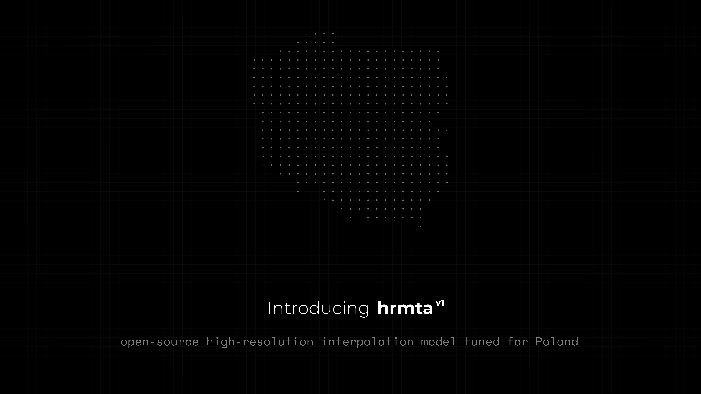
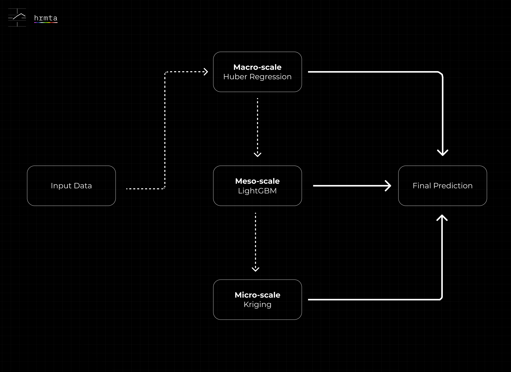
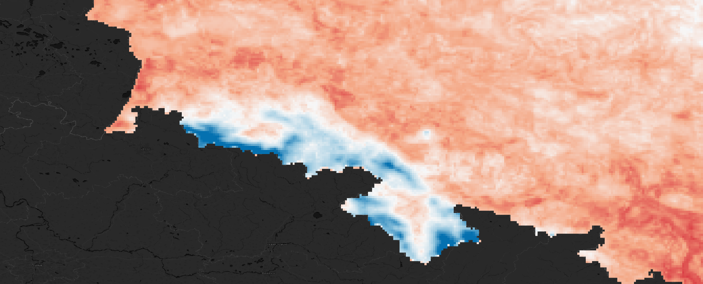
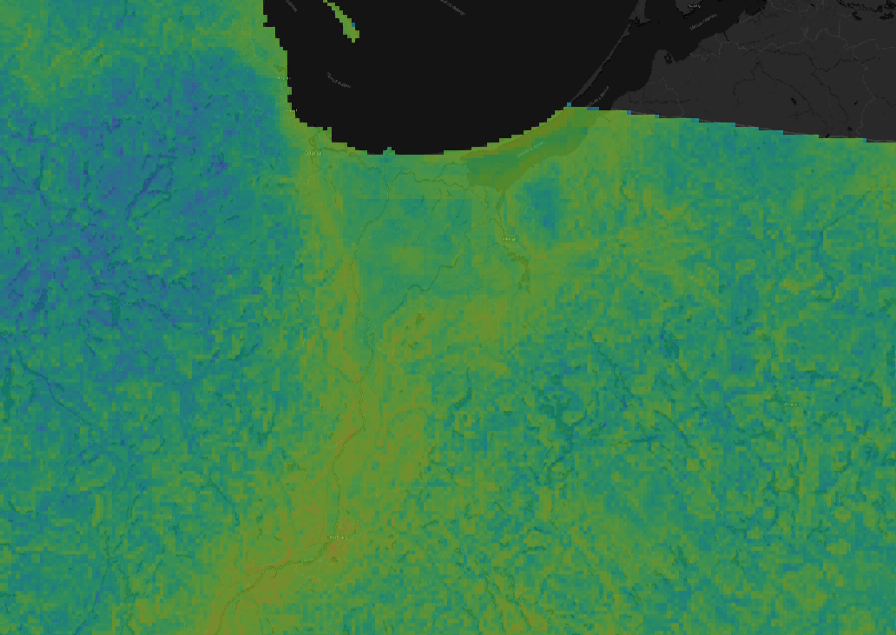
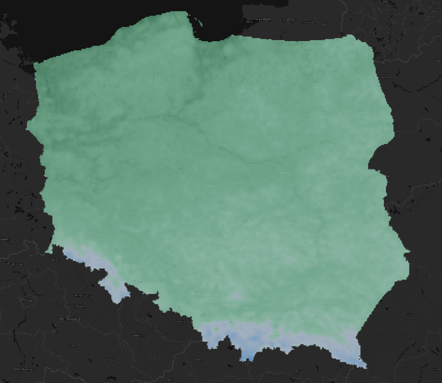
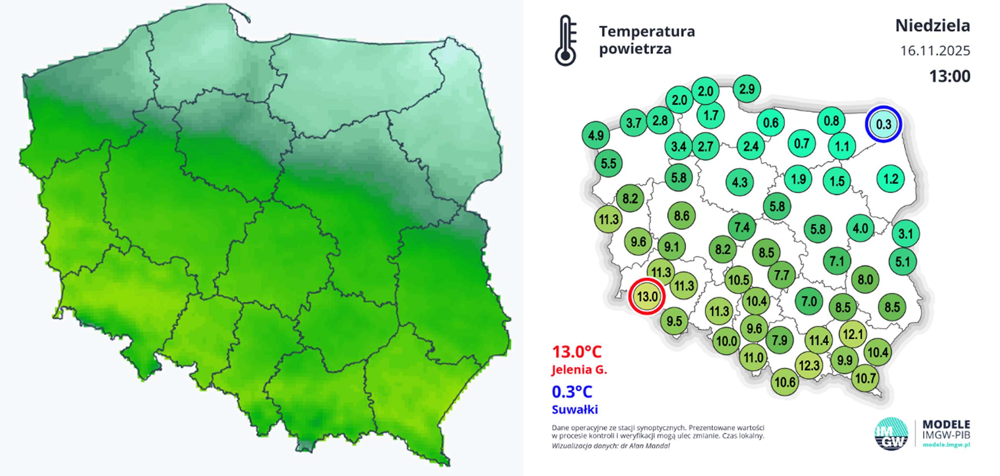

<div align="center">
  
  <br><br>
  
  # HRMTA
  
  **High-Resolution Mesoscale Temperature Analysis**
  <br>

  <p align="left">
    <strong>HRMTA</strong> is an operational, hybrid ML-geostatistics engine designed primarily to interpolate high-resolution (up to 1 km) temperature fields in complicated terrain like river valleys, uplands, spits, and mountain slopes, all in real-time, with the aim of outperforming current traditional methodologies for temperature interpolation like Kriging by achieving a superior physical realism while staying computationally efficient. Currently tuned specifically for Poland, it fuses multi-source station observations with environmental physics to correct for Urban Heat Islands, elevation lapse rates, and local microclimates.
  </p>
</div>

---

## Table of Contents
1. [Starting the pipeline](#starting-the-pipeline)
2. [Configuration](#configuration)
3. [Architecture](#architecture)
4. [Limitations](#limitations)
5. [Official blog](#official-blog)
6. [Roadmap](#roadmap)
7. [FAQ](#faq)
8. [License](#license)
9. [Data](#data)
10. [Gallery](#gallery)

## Starting the pipeline
HRMTA is based on a subset of complex geospatial libraries, therefore it is strongly recommended to use Anaconda ([install it here](https://www.anaconda.com/download)) or Miniconda ([install it here](https://docs.anaconda.com/miniconda/)).

### 1. Clone the repository
```bash
git clone https://github.com/BingerDev/HRMTA.git

cd HRMTA
```

### 2. Create an environment (Recommended!)
```bash
conda create -n hrmta python=3.9

conda activate hrmta
```

### 3. Install dependencies
```bash
pip install -r requirements.txt
```
> [!NOTE]
> **For Windows users:** If you encounter any errors installing `rasterio` or `fiona` via pip, please try installing them via conda instead:
> `conda install -c conda-forge geopandas rasterio`

### 4. Netatmo integration [OPTIONAL]
If you want to add even more weather stations on the map, you can use an optional PWS station data provider (Netatmo) built into the model. To access it, you need to obtain an API key from their official page:

1. Proceed to [Netatmo Weather API](https://dev.netatmo.com/apidocumentation/weather).
2. Sign up for your account.
3. Click **"My apps"**.
4. Create a new app.
5. Scroll down to the **"Token generator"** and generate a token for a `read_station` scope.
6. Copy the token.
7. Create a file named `.env` in the project root directory (same folder as `run.py`).
8. Add your obtained token inside the newly created file using this format:

   ```env
   NETATMO_TOKEN=your_api_token_goes_there
   ```

> [!NOTE]
> Please take into account that this step is optional and the model pipeline will normally operate even without Netatmo data being available. The model will default to IMGW and Traxelektronik observational data, which is configured automatically and you don't have to obtain any additional API keys for it. Consider whether you would like to have a few hundred additional weather station data or if that is too time-consuming for you and you would like to proceed automatically using default observational data sources.

### 5. Run the pipeline
Generate your first temperature map by running the next command in your terminal:
```bash
python run.py
```
Now, you should see your first temperature map that has appeared as `temperature_map.png` in the `output/` folder alongside other model performance maps.
> [!NOTE]
> At first launch, the model is going to run for a bit longer compared to average runtime speed, as the model will have to set up everything for the first time on this device. However, later on, the model should be running at normal runtime speeds.

## Configuration
All configuration variables are being stored in the model's main configuration file located in `src/config.py`. The project has been optimized specifically to make most of its core features easily customizable for the user from the configuration file. Currently, the default values are optimized for the best model performance. However, it may still not be perfect. Here's an explanation for the main variables defined in the config:
- `COLOR_SCALE` - Path for the color scale CSV file. You can edit the color scale in any way and change it to any color scale that you would like by grabbing your color scale and editing it to a value/HEX code format inspired by the current format of the data present in the file. The default path for the color scale file is `inputs/input-PL/color_scale.csv`. All the values are provided in °C.
- `IMGW_DATA_MODE` - all/observations/model. This allows you to control what IMGW data you want to be fetched into the model. The provider of the data provides model and observation data for IMGW weather stations. By default, it is set to all, so that the model is using most of the data, although some of the data might be lower quality compared to actual measurements, therefore you might want to switch the mode to `observations`.
- `PERFORM_SPATIAL_QC` - True/False. This variable is responsible for the Spatial Outlier detection system that corrects station measurement errors using its neighbors.
- `QC_NEIGHBORS` - Number of neighbor stations that the spatial outlier system should look for.
- `QC_Z_THRESHOLD` - Standard deviation threshold in °C used for station flagging.
- `QC_ABS_THRESHOLD` - Absolute difference threshold in °C for automatically flagging stations with a large margin of error.
- `QC_LAPSE_RATE` - Standard lapse rate in °C/m that is being used for elevation adjustment later on.
- `GRID_RESOLUTION` - Crucial variable that most of the users will likely wish to change the most frequently from time to time. This parameter is responsible for the entire resolution of the temperature map in meters. For example, `5000` stands for `5 km`. The higher the resolution is, the slower the model will run.
- `APPLY_SMOOTHING` - True/False. Allows you to apply smoothing to the temperature map.
- `SMOOTHING_SIGMA` - If `APPLY_SMOOTHING` is set to True, this parameter allows you to control the intensity of smoothing that is being applied. The higher the value is, the more smoothed the temperature map will get.
- `DISPLAY_STATION_SOURCES` - You can use this parameter to choose which observational data sources you want to be displayed on the map. Due to potential conflicts between more accurate and less accurate temperature readings, the default setting is set to IMGW stations display and it is the recommended setting. However, if you would want to display all the station data that the model is being trained on, then you can add Traxelektronik and/or Netatmo to the list by adding a comma and following the existing format.

We strongly don't recommend editing any other variables in the configuration file, especially ones related to Spatial CV and the model architecture itself, unless you are an expert and know what you are doing. Edit the configuration file with responsibility.

## Architecture
The model architecture is built on three different layers of interpolation, each of which fixes the errors and limitations of the previous one. Each layer has been carefully picked and developed for the most optimal model performance after a long time of evaluation and experimenting with different architectures.

After the model is provided with large subsets of environmental and observational datasets, it runs a Huber Regression, which acts as a physics baseline for the model. In short, it calculates the base relationship between temperature and lapse rate in the model.

Then, the model runs a LightGBM, which is the primary Machine Learning (ML) layer in the model. It predicts the errors of the previously run Huber Regression model based on provided subsets of environmental data. It is capturing non-linear relationships that a simple math model wouldn't be able to calculate and it is crucial for interpolation of smaller temperature relationships in the model, such as river influence, elevation factor, or Urban Heat Island. LightGBM has been chosen over other ML models like XGBoost or RF primarily due to how computationally efficient it is, which was crucial for the goal of developing the most efficient model in terms of accuracy correlation with compute.

Finally, a simple kriging layer is run, which is also crucial for the model performance. It interpolates the remaining errors that none of the previous layers were able to explain. Basically, it is a fine-tuning layer to ensure spatial continuity and stable performance of the model.



## Limitations
While the model has been made to overcome frequent challenges with traditional interpolation models and optimize for the best accuracy and computational efficiency, it still has numerous important limitations that are important to acknowledge while using the model:
- The model is not some magic genie, therefore you're not going to receive perfect temperature values from the model. It acts like a physically plausible temperature estimator, and every such tool has its own margin of error.
- Due to the architecture of the model, Kriging is still likely to outperform HRMTA in point-to-point accuracy, primarily during stable temperature conditions. This is because HRMTA architecture prioritizes physical realism over mathematical perfectionism. HRMTA is designed to specifically create a physically accurate temperature field. While simple interpolation models like Kriging or IDW are simply connecting the station readings to extract the most likely temperature value for a given point, HRMTA integrates actual physics into the model and forces it to interpolate a temperature field that makes physical sense.
- There are highest grid resolution constraints for this specific version of the model. Because the model is being trained on the extent of the entire Poland, the input environmental data is really coarse and has a limited resolution. If you try to interpolate at a grid resolution higher than the absolute highest effective resolution (which is around 1 km), not only the model runtime will skyrocket and get unsuitable for operational usage, but also the model is not going to produce any new data and unexpected behavior is almost guaranteed, resulting in severe model performance degradation.
- The model pipeline is overly dependent on the exact structure of observational data. If anything changes, the model data extraction from this specific data source will fail. However, this is already being handled in the model - if one data source fails to fetch, the model will still run with other available data sources.
- Due to how automatic geocoding for the station data is being handled in the code, it introduces some level of uncertainty directly into the model, which is one of the main sources of error in the model.
- The model is diagnostic and intended primarily for interpolation of the current temperature field. It is not a weather forecasting tool.
- Some of the pipeline and the entire model's environmental and observational datasets have been optimized specifically and strictly for the extent of Poland. Changing the country of interpolation is currently pretty challenging and is manual. It requires deep knowledge of the topic and is time-consuming.
- Because of the model aggregating data from different sources with varying refresh rates, there could be some issues during rapidly moving cold fronts or other rapidly progressing phenomena. It is likely that the model interpolation may sometimes slightly lag compared to the actual observations in such conditions.
- The current Spatial Quality Control system that aims to reduce the impact of low-quality observational data on model's performance is still not perfect. For example, right now, this system might also drop reliable stations due to the large deviation of temperature and it treats actual temperature as noise. Further development of the quality control system is planned in the future.
- The model performance is not fully guaranteed at this stage of development. Occasional errors and performance degradations are not excluded.

## Official blog
For further details about the previous iterations of the project that were never released publicly and for learning about the entire project development history with some additional visualizations and useful information, please refer to the [official blog](https://medium.com/@gorlicjakub/update-on-high-resolution-mesoscale-temperature-analysis-hrmta-9713e73761a4). I highly encourage you to read this blog as it contains much more information compared to this description along with a lot of interesting sections that weren't included in this GitHub project documentation.

## Roadmap
The model's trajectory in the future will be leaning towards experimental solutions aiming to further reduce the margin of error. Currently, the most high-priority plans include introduction of a higher amount of both environmental and observational data, development of more robust guards against unreliable data sensors, and refinement of the physics engine to allow for multi-parameter interpolation beyond just temperature. It is also worth mentioning that between larger updates, the model will continuously improve based on gathered user feedback.

## FAQ
**How do I run the model?**

The model is easy to run and setup. For detailed step-by-step instructions, please follow [this guide](#starting-the-pipeline).

**How to change the resolution of the temperature map?**

You would have to change the value of `GRID_RESOLUTION` variable in the `src/config.py` file, which is currently being provided in meters.

**Why is HRMTA superior compared to the traditional interpolation methodologies?**

The main advantage of HRMTA is that it excels at physical realism and robustness. Other interpolation methodologies like Kriging are designed to handle temperatures in a smoothed and simplified way. They will simply smooth the gradient between two points, while HRMTA is able to actually explain the data even in conditions with lack of data. If it will be cold on a certain mountain summit, the model will know that even if there is no weather station on there. What's more, traditional approaches can't simulate impact of microclimates on the temperature, such as those generated by cities. HRMTA can do it, as it is specifically trained on relevant environmental dataset to accomplish the task. Also important to mention that other systems are known for their inability to handle low-quality sensor data and are prone to the interpolation of extremes on the map, while HRMTA effectively handles that by its robust physics baseline and existing & planned methodologies to minimize the impact of low-quality sensor data on the model performance. Summarizing it, traditional systems are way too simplified and assume linear, simple spatial relationships, while HRMTA is designed to handle complex and non-linear interactions.

**Is it possible to interpolate temperature data beyond Poland using this model?**

No, at least not yet. There are plans to automatically include more pre-built datasets for more European countries, but these are more long-term plans. Currently. we are focusing on Poland to explore different technologies before moving to a wider coverage.

**Is there a way to switch between smoothed and gridded output?**

Yes, of course. The smoothing of the temperature map is being determined by the `APPLY_SMOOTHING` variable in the `src/config.py` configuration file. If set to `True`, the map gets smoothed. If set to `False`, the model produces raw, gridded data according to the chosen resolution.

**What are the current limitations of HRMTA?**

There is a significant portion of the text describing current main limitations of the model that you should always be aware of. Please refer to the [Limitations](#limitations) section.

**How long does it take to run the model?**

It depends on the selected resolution in the configuration file. By default, the resolution is set to 5 km, and it usually takes approximately 5-10 minutes to fully run the model after first initialization run.

**How does the model handle larger margin of error of observational data with PWS/RWS stations?**

The model runs a dedicated technology for that, the Spatial Quality Control. Basically, it compares a station reading with its neighbors while adjusting for elevation differences. If the sensor gets detected as statistically too far from the neighbor observations, it automatically gets flagged and removed from the model training. However, this approach is still not perfect and it has its own limitations, therefore more and better solutions for this challenge will be developed in future versions of the project.

**What are the system requirements needed to properly run the model?**

At the current stage, the model is designed to be lightweight, therefore the model is optimized for any kind of modern hardware with a standard CPU.

**What if one of the model observational data provider sources goes down?**

The model will effectively handle that by skipping that exact source of data and continuing to run the pipeline with the available data.

**Can I use this model to forecast temperature in my hometown tomorrow?**

No, absolutely not. HRMTA is only a diagnostic tool that is intended for real-time interpolation of data at the current timestamp.

## License
Source code of HRMTA is being licensed under the **MIT License**. Please see the [LICENSE](LICENSE) file for details.

## Data
The environmental dataset (`input-PL`) contains pre-processed snippets from third-party sources. These files are distributed under their respective open licenses.
*   **Check [DATA_LICENSE.txt](inputs/input-PL/DATA_LICENSE.txt)** for full legal attribution and usage terms regarding the input environmental dataset.
*   Usage of observational data from IMGW, Traxelektronik, and Netatmo is subject to the terms of service of those respective providers.

## Gallery








