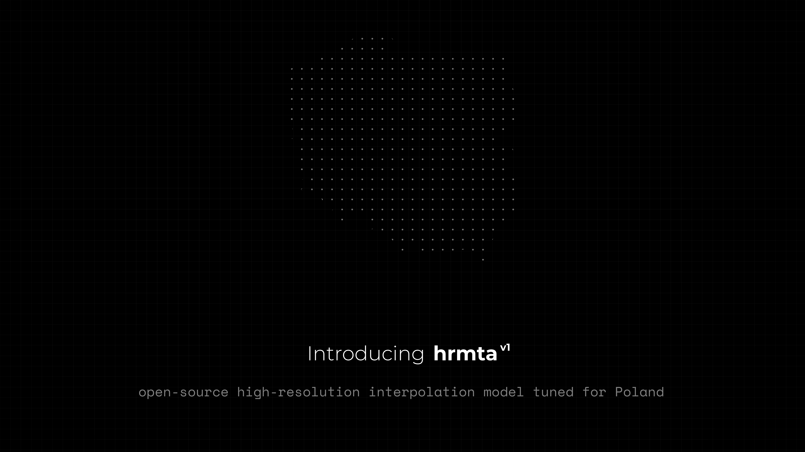
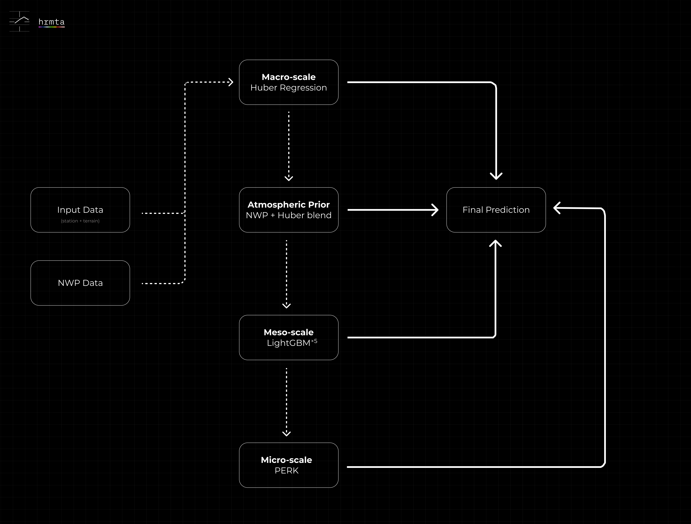
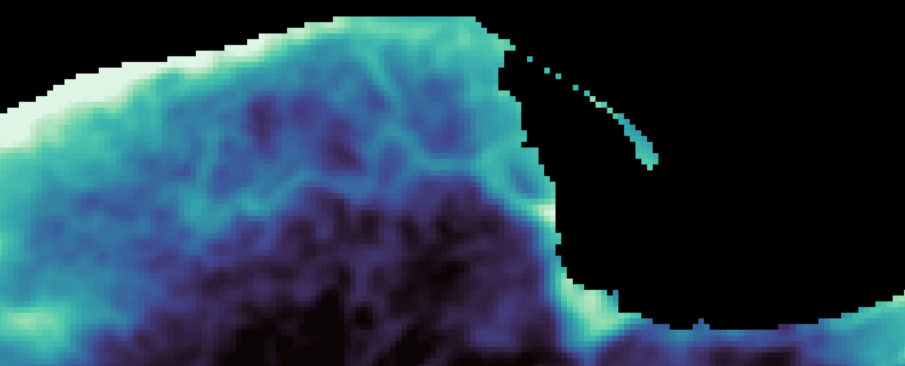
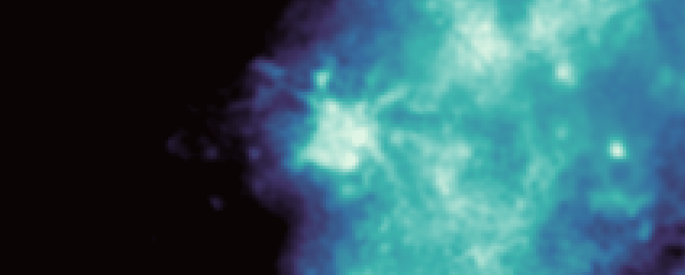
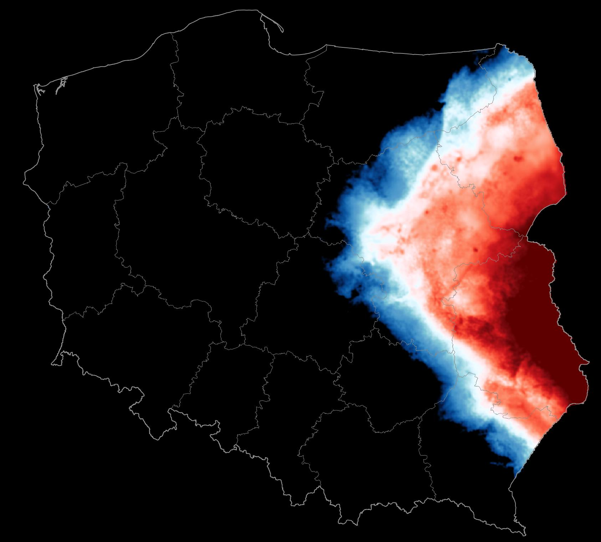
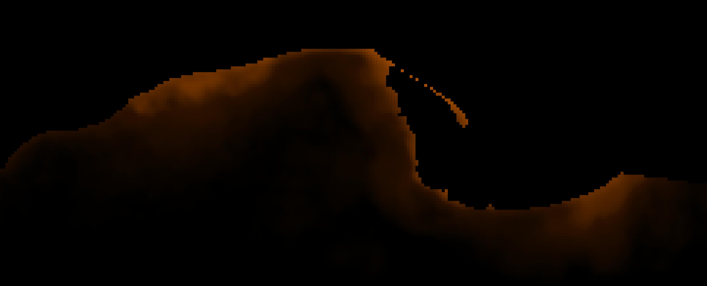

<div align="center">
  
  <br><br>

  # HRMTA

  **High-Resolution Mesoscale Temperature Analysis**
  <br>

  <p align="left">
    <strong>HRMTA</strong> is an operational, physics-aware ML-geostatistics engine designed primarily to interpolate high-resolution (up to 100 m effective resolution) temperature fields across complex terrain like river valleys, mountain slopes, and urban areas, all in real-time, fusing multi-source station observations with a dual Numerical Weather Prediction (NWP) engine and a comprehensive environmental dataset at 100-meter resolution to produce physically realistic continuous air temperature maps while staying computationally efficient enough for operational deployment. It is currently tuned specifically for Poland, and is built on a 4-stage robust stacking architecture with adaptive NWP trust mechanisms and consistently outperforms raw NWP predictions across all tested conditions.
  </p>
</div>

---

## Table of Contents
1. [Starting the pipeline](#starting-the-pipeline)
2. [Modes](#modes)
3. [Data tiers](#data-tiers)
4. [Configuration](#configuration)
5. [Architecture](#architecture)
6. [Limitations](#limitations)
7. [Official blog](#official-blog)
8. [Roadmap](#roadmap)
9. [FAQ](#faq)
10. [License](#license)
11. [Data](#data)
12. [Gallery](#gallery)

## Starting the pipeline
HRMTA is based on a subset of complex geospatial libraries, therefore it is strongly recommended to use Anaconda ([install it here](https://www.anaconda.com/download)) or Miniconda ([install it here](https://docs.anaconda.com/miniconda/)).

### 1. Clone the repository
```bash
git clone https://github.com/BingerDev/HRMTA.git

cd HRMTA
```

### 2. Create an environment (Recommended!)
```bash
conda create -n hrmta python=3.10

conda activate hrmta
```

### 3. Install dependencies
```bash
pip install -r requirements.txt
```
> [!NOTE]
> **For Windows users:** If you encounter any errors installing `rasterio` or `fiona` via pip, please try installing them via conda instead:
> `conda install -c conda-forge geopandas rasterio`

### 4. Download the input data
The model requires a pre-built environmental raster dataset to run. Due to the size of this data, it is hosted on Zenodo. Choose one of the three available data tiers depending on your needs and download the corresponding archive:

| Data tier | Size | Description |
|---|---|---|
| **Lite** | ~150 MB | DEM only + runtime terrain derivatives |
| **Standard** | ~900 MB | DEM + terrain physics rasters (TPI, SVF, CAP, HAND) |
| **Full** | ~1.2 GB | All 16 rasters including environment layers (like building or canopy height) |

**Download:** [HRMTA v1.4.0 raster dataset on Zenodo](https://zenodo.org/records/19266719)

After downloading, you should extract the contents of the archive into the `inputs/input-PL/` folder in the project root directory. The `.tif` raster files must be placed directly inside this folder.

> [!IMPORTANT]
> At minimum, the model requires the Digital Elevation Model (DEM) raster to run. If the DEM is not found in `inputs/input-PL/`, the pipeline will stop with an error pointing you to this section. All other rasters are optional and the model will continue to run with reduced accuracy (!) if they are not present, also printing you a warning about which rasters are missing along with your current data tier setting information.

### 5. Netatmo integration [OPTIONAL]
If you want to add even more weather stations on the map, you can use an optional PWS station data provider (Netatmo) built into the model. To access it, you need to obtain an API key from their official page:

1. Proceed to [Netatmo Weather API](https://dev.netatmo.com/apidocumentation/weather).
2. Sign up for your account.
3. Click **"My apps"**.
4. Create a new app.
5. Scroll down to the **"Token generator"** and generate a token for a `read_station` scope.
6. Copy the token.
7. Create a file named `.env` in the project root directory (same folder as `run.py`).
8. Add your obtained token inside the newly created file using this format:

   ```env
   NETATMO_TOKEN=your_api_token_goes_there
   ```

> [!NOTE]
> Please take into account that this step is optional and the model pipeline will normally operate even without Netatmo data being available. The model will default to IMGW, Traxelektronik, and Edwin observational data, which is configured automatically and you don't have to obtain any additional API keys for it. Consider whether you would like to have a few hundred additional weather station data or if that is too time-consuming for you and you would like to proceed automatically using default observational data sources.

### 6. Run the pipeline
Generate your first temperature map by running the next command in your terminal:
```bash
python run.py
```
Now, you should see your first temperature map that has appeared as `temperature_map.png` in the `output/` folder alongside other model performance maps.
> [!NOTE]
> At first launch, the model is going to run for a bit longer compared to average runtime speed, as the model will have to set up everything for the first time on this device. Also, if you are using Pro mode, the first run will need to download current NWP data from HARMONIE and ICON-EU, which may take some additional time depending on your internet connection. However, later on, the model should be running at normal speeds with the NWP cache already in place.

## Modes
With the introduction of the dual NWP engine in v1.4.0, the model now supports two configuration modes that determine whether NWP data is being used in the pipeline. The mode is controlled by the `MODE` setting in `src/config.py`.

- **Standard** - Pure observation-based interpolation that still benefits from all the core architecture refinements of v1.4.0, including the ensemble LightGBM, PERK, refined QC system, and the completely redesigned environmental dataset, but operates without NWP data, relying purely on station observations and terrain features, similarly to previously available versions. This mode is useful particularly for lightweight execution, comparison purposes, or for cases where NWP data for some reason might be temporarily unavailable.

- **Pro** *(recommended)* - Includes everything from Standard plus full dual NWP integration from HARMONIE-AROME DMI (~2.5 km) and ICON-EU (~6.5 km) models, with the Atmospheric Prior trust mechanism, NWP-derived interaction features, and the Quality Gate feature. The NWP data is automatically downloaded and processed by the pipeline without any additional API keys nor dependencies required. This mode provides the absolute highest performance, with a validated ~17% RMSE improvement over v1.3.1 and consistent outperformance of raw NWP predictions in all conditions. The trade-off is a slightly longer runtime and additional disk space for NWP cache, but it is generally recommended to always use Pro mode for the best results.

> [!NOTE]
> The mode setting is independent from the data tier setting. You can combine any mode with any data tier depending on your needs. For example, `MODE="pro"` with `DATA_TIER="lite"` gives you NWP-driven accuracy with the smallest environmental dataset footprint.

## Data tiers
Due to the significant expansion of the environmental raster dataset in v1.4.0, where the full dataset grew from ~50 MB in v1.3.1 to ~1.2 GB, which is about 24× larger, it was necessary to implement a new data tier system that controls how much of the environmental dataset the model loads. The data tier is controlled by the `DATA_TIER` variable in `src/config.py` and is independent from the mode setting.

- **Lite** (~150 MB) - Includes just the high-resolution DEM along with runtime derivatives like slope, aspect, Topographic Position Index (TPI), roughness, and curvature. The model relies primarily on coordinates and NWP features (in Pro mode) for its predictions. Grid resolution is capped to 1 km at this tier.

- **Standard** (~900 MB) - Lite + terrain physics rasters derived from DEM: TPI at 500 m and 2 km scales, Sky View Factor (SVF), Cold Air Pooling (CAP) anomaly, and HAND (Height Above the Nearest Drainage). This tier provides physics-grade cold pool and microclimate modeling without the environment layers.

- **Full** (~1.2 GB) - Standard + all remaining environment rasters, including population data (LandScan), land cover classification, settlement fraction, imperviousness, forest fraction, land surface temperature composite, water fraction, canopy height, building height, and cropland fraction. It is the maximum feature set with the best accuracy.

> [!NOTE]
> The model will gracefully handle missing rasters at any tier level. If rasters are missing, the pipeline will print a warning with the list of missing rasters and will continue to run with a reduced feature set. However, the DEM is always required and the model will not start without it.

## Configuration
All configuration variables are stored in the model's main configuration file located in `src/config.py`. The project has been optimized to make most of its core features easily customizable from the configuration file. Here's an explanation for the main variables:

**Core settings:**
- `MODE` - `"standard"` or `"pro"`. Controls whether the model uses NWP data in the pipeline. See the [Modes](#modes) section for details.
- `DATA_TIER` - `"lite"`, `"standard"`, or `"full"`. Controls which environmental raster layers are loaded. See the [Data tiers](#data-tiers) section for details.
- `GRID_RESOLUTION` - Resolution of the temperature map in meters. For example, `1000` stands for 1 km. The higher the resolution is, the slower the model will run but the more spatial detail will be present on the map.
- `INTERPOLATION_REGION` - Region of interpolation. By default set to the entire Poland, but you can set it to a specific voivodeship name like `"Mazowieckie"` or `"Małopolskie"`. It also supports English names. Regional scale helps to significantly reduce the runtime.

**Visualization:**
- `COLOR_SCALE` - Path for the color scale CSV file. You can edit the color scale in any way and change it to any color scale that you would like by following the existing value/HEX code format. The default path is `inputs/input-PL/color_scale.csv`. All the values are provided in °C.
- `DISPLAY_CONTOURS` - `True`/`False`. When enabled, isotherm contour lines are overlaid on the temperature map for easier visual interpretation of the temperature field.
- `CONTOUR_INTERVAL` - Spacing between isotherm contour lines in °C.
- `DISPLAY_COUNTIES` - `True`/`False`. Displays county boundaries on the map. Works in both national and regional modes.
- `DISPLAY_CLEAN_MODE` - `True`/`False`. When enabled, only the map, its overlays, and the color scale are displayed, without title, source footer, and Tmax/Tmin callouts. Useful for dashboard embedding, website integration, or social media.
- `DISPLAY_STATION_SOURCES` - `"IMGW"`/`"TRAX"`/`"EDWIN"`/`"NETATMO"`. Controls which observational data sources are displayed as station points on the map.


**Data and processing:**
- `IMGW_DATA_MODE` - `"all"`/`"observations"`/`"model"`. Controls what IMGW data is fetched into the model. By default set to `"all"`, so that the model is using most of the data, although some of the model data might be lower quality compared to actual observations.
- `APPLY_SMOOTHING` - `True`/`False`. Allows you to apply smoothing to the temperature map.
- `SMOOTHING_SIGMA` - Controls the intensity of smoothing being applied. The higher the value, the more smoothed the map will get.
- `KEEP_RUN_HISTORY` - `True`/`False`. When `True`, saves output data to a dedicated, timestamped folder each time you run the model. When `False`, files are being overwritten in `output/`, which helps to reduce disk space when running frequently.
- `REGIONAL_BUFFER_KM` - Buffer distance in km from the selected region borders in regional mode. Helps to enhance the model awareness of conditions outside the region by using additional station data around it.
- `PERFORM_SPATIAL_QC` - `True`/`False`. Enables the Spatial Quality Control system (FS-ISCT) that validates each station observation against its neighbors after adjusting for expected differences due to terrain.

We strongly don't recommend editing any other variables in the configuration file, especially ones related to Spatial CV, QC hyperparameters, and the model architecture itself, unless you are an expert and know what you are doing. Edit the configuration file with responsibility.

## Architecture
The model architecture of v1.4.0 is built on four stages of interpolation, where each stage is designed specifically to handle something that the previous one can't. Each stage has been carefully developed and evaluated after a long history of experimentation with different architectures across all previous iterations of the project, optimizing for the best balance between accuracy and computational efficiency.

**Stage 1: Huber Regression (Physics baseline)**

The first stage of the pipeline is responsible for constructing the physics baseline of the entire system. It captures the large-scale relationship between elevation and temperature (the lapse rate), plus geographic gradients like latitude and distance from the coast. It acts as the physics anchor of the model, and it is critical that this component remains simple and robust, because every other stage builds on top of it. If this stage overfits or fails, everything downstream collapses. However, a stable physics baseline alone still leaves the model with the same fundamental blindness that limited all previous versions, as it doesn't know what's happening in the atmosphere right now.

**Stage 1.5: Atmospheric Prior (Pro mode only!)**

This component is entirely new in v1.4.0 and was absent from all previous versions of the project. Before the ML model sees the data, there is now a blending step that creates a trust-weighted blend of the Huber prediction and the NWP prediction at each location. If the NWP is performing well, the blend leans toward NWP data. If NWP is performing poorly (which the pipeline learns by comparing NWP predictions against nearby station observations), it falls back toward pure Huber. This gives the core ML model a significantly better starting point, because instead of learning the entire temperature pattern from terrain features alone, it receives residuals from a prediction that already contains atmospheric physics. In areas where NWP is accurate, the residuals are small and LightGBM barely needs to correct anything. Where NWP struggles, the residuals are larger and the ML model has more work to do. This safety mechanism was specifically designed to prevent the model from following NWP failure modes, so that it always stays ahead of raw NWP.

**Stage 2: LightGBM Ensemble (core ML engine)**

The core ML engine of the model. Previously, a single LightGBM model was used, and now it's 5 independent models with completely different random seeds, where each sees a slightly different subsample of the training data. By averaging them, the random errors wash out and the true signal gets reinforced, which effectively reduces variance without increasing bias. The disagreement between the five models also provides a reasonable uncertainty estimate. The LightGBM parameters have been carefully re-tuned for v1.4.0 to be more conservative by design, because the model now has many more features to learn from and needs reliable protection against overfitting.

**Stage 3: PERK: Post-Ensemble Residual Kriging (Spatial correction)**

The final Kriging mechanism has been fundamentally changed compared to previous iterations, where each model had its own Kriging pass. In v1.4.0, Kriging is applied only once on the consensus residuals after all 5 ensemble members complete their predictions. With the ensemble mean, model-specific noise is averaged out, so Kriging sees a cleaner signal and produces better corrections. This also speeds up the computation by approximately 80% (one Kriging pass instead of five), while simultaneously producing smoother spatial corrections.



## Limitations
While the model has been designed to overcome challenges with traditional interpolation approaches and optimize for the best accuracy and also the computational efficiency of the model, it still has important limitations that should be acknowledged:
- The model is not a magic solution, therefore you are not going to receive perfect temperature values from it. It acts like a physically plausible temperature estimator, and every such tool has its own margin of error.
- NWP data availability is not guaranteed. Model runs from HARMONIE-AROME or ICON-EU can sometimes be temporarily unavailable. The pipeline handles this through its fallback logic, but it is a dependency that can affect Pro mode performance when it happens.
- NWP resolution is still coarser than the output grid. Even HARMONIE at ~2.5 km can't resolve sub-kilometer terrain effects directly, which is exactly why the terrain dataset and ML correction layers exist on top of it.
- Because NWP model runs update only every few hours, between these updates the atmospheric data can become increasingly stale, which especially matters during rapidly evolving weather like fast moving cold fronts.
- At the native raster resolution scale (~100 m), the temperature field is derived almost entirely from the environmental terrain predictors. These finest patterns represent the model's best estimate of how terrain modulates temperature, they are physically informed but not independently verified at that scale.
- The model pipeline is dependent on the exact structure of observational data sources. If anything changes with external data providers, that specific source will fail. However, if one source fails to fetch, the model will still run with the remaining available data.
- Some of the observational data sources provide only place names of the stations without precise coordinates. This introduces a layer of spatial uncertainty through automated geocoding, which is still one of the sources of error in the model.
- The model is diagnostic and intended primarily for interpolation of the current temperature field. It is not a weather forecasting tool.
- The pipeline and the environmental datasets have been optimized specifically and strictly for the extent of Poland. Changing the country of interpolation is manual, requires deep knowledge of the topic, and is not recommended without significant expertise.
- The Spatial Quality Control system, while significantly improved in v1.4.0 with continuous confidence weights and feature-space consistency testing, is still not perfect. There are edge cases where reliable stations may receive lower confidence weights or where faulty stations could pass through.
- At the current stage of the model's development, its performance is not guaranteed and occasional errors may occur.

## Official blog
For very detailed information about the architecture of the model, benchmark results, practical examples, and the entire project development history along with its philosophy, please visit the official project blogs:
- **["The new epoch in Poland's frontier open-source weather interpolation technology"](https://medium.com/@gorlicjakub/the-new-epoch-in-polands-frontier-open-source-weather-interpolation-technology-330d30482141)**: Very insightful article about the fundamental architecture reimagination of v1.4.0, including NWP integration, terrain dataset upgrade, detailed benchmark analysis with 10-run SLOOCV validation, practical examples, and more.
- **["Update on High-Resolution Mesoscale Temperature Analysis"](https://medium.com/@gorlicjakub/update-on-high-resolution-mesoscale-temperature-analysis-hrmta-9713e73761a4)**: The original project blog covering the entire development history from September 2024 through its first public release in December 2025.

I highly encourage you to read especially the v1.4.0 blog as it contains significantly more detailed information about all of the changes and the reasoning behind them, along with detailed benchmark analysis and visualizations that weren't included in this documentation.

## Roadmap
The project's trajectory in the near future is primarily leaning towards two main directions. The first and most important direction is the transition from a temperature-only interpolation approach to a multi-parameter interpolation engine, which is expected to happen progressively over the next few months. The second direction is the continuous refinement of the environmental raster dataset, including exploration of new sources like Sentinel-3 SLSTR for land surface temperature, topology-aware drainage modeling, and integration of new satellite observations such as MTG-S1, Europe's first geostationary satellite sounder. Along with these major directions, the model will be continuously improved based on received user feedback. Furthermore, as the severe weather season of 2026 approaches in Europe, more attention is expected to be given to the storm chasing community, both to investigate model performance in convective environments and to explore how the model may benefit chasers during dangerous weather events. Long-term plans for international expansion of the model extent remain largely unchanged, and an update on that is expected to follow by the end of the year.

## FAQ
**How do I run the model?**

The model is easy to run and setup. For detailed step-by-step instructions, please follow [this guide](#starting-the-pipeline).

**What are the differences between Standard and Pro mode?**

Standard mode uses station observations and terrain features only, without NWP data, while still benefiting from all the core architecture improvements of v1.4.0. Pro mode adds full dual NWP integration from HARMONIE-AROME and ICON-EU on top, which provides significantly better accuracy and physical realism, especially in sparse areas and during complex weather conditions like temperature inversions. It is generally recommended to always use Pro mode. See [Modes](#modes) for more details.

**Which data tier should I use?**

It depends on your needs and available disk space. For quick testing or a lightweight setup, Lite (~150 MB) is sufficient and will provide a reasonable result, especially in Pro mode where NWP data compensates for the smaller terrain dataset. For the best accuracy with the full environmental dataset, use Full (~1.2 GB). Standard is a good middle ground focused on terrain physics with cold pool and microclimate modeling. See [Data tiers](#data-tiers) for a detailed comparison.

**How to change the resolution of the temperature map?**

You would have to change the value of `GRID_RESOLUTION` variable in the `src/config.py` file, which is provided in meters. Keep in mind that the effective resolution depends on your data tier: Full supports up to 100 m, Standard up to 250 m, and Lite up to 1 km. Setting a resolution finer than what your tier supports will trigger a warning.

**Why is HRMTA better compared to traditional interpolation methodologies?**

The main advantage of HRMTA is that it excels at physical realism and robustness. Traditional interpolation approaches like Kriging or IDW will simply smooth the gradient between observation points, while HRMTA is able to actually explain the data even in areas with very limited station coverage. Thanks to its NWP integration in Pro mode, the model understands much more about the current state of the atmosphere, which is critical for complex weather conditions like temperature inversions, radiative cooling patterns, or frontal passages. What's more, HRMTA handles low-quality sensor data through its robust Quality Control system with continuous confidence weighting, while traditional approaches are known for their sensitivity to measurement errors and inability to distinguish between reliable and unreliable observations. Summarizing it, traditional systems assume simple, linear spatial relationships, while HRMTA is designed to handle complex, non-linear interactions through physics-aware machine learning.

**Is it possible to interpolate temperature data beyond Poland?**

No, at least not yet. There are long-term plans to expand the model extent to more European countries, but currently the focus remains on Poland. An update on this will follow by the end of the year.

**Can I run the model only for a specific region of Poland?**

Yes, in order to do that you need to simply update the value of `INTERPOLATION_REGION` in `src/config.py` with a voivodeship name, either in Polish or in English, like `"Mazowieckie"`. Regional scale also helps to significantly reduce the runtime.

**Is there a way to switch between smoothed and gridded output?**

Yes, of course. The smoothing of the temperature map is being determined by the `APPLY_SMOOTHING` variable in `src/config.py`. If set to `True`, the map gets smoothed. If set to `False`, the model produces raw, gridded data according to the chosen resolution.

**What are the current limitations of HRMTA?**
There is a significant portion of the text describing current main limitations of the model that you should always be aware of. Please refer to the [Limitations](#limitations) section.

**How long does it take to run the model?**

It depends on the selected resolution, mode, and the interpolation extent. By default (Pro mode, 1 km, national scale), the model usually takes approximately 10–15 minutes to fully run after the first initialization. Standard mode is slightly faster as it doesn't require NWP data download. Regional scale also significantly reduces the runtime. The first run will take somewhat longer as the model sets up caches and downloads NWP data for the first time.

**How does the model handle unreliable observational data?**

The model runs a dedicated technology for that, the FS-ISCT (Feature-Space Iterative Spatial Consistency Test). Instead of simple binary outlier flagging, it assigns continuous confidence weights to each station by comparing observations against their neighbors in both geographic and feature space, while adjusting for expected temperature differences due to terrain. Stations with readings that are inconsistent with their surroundings receive lower weights rather than being completely removed, which preserves information while reducing the impact of measurement errors. However, this approach still has its own limitations.

**What if one of the data sources goes down?**

The model effectively handles that by skipping the unavailable source and continuing the pipeline with remaining data. Similarly, if NWP data is unavailable in Pro mode, the pipeline falls back gracefully to terrain-only predictions.

**Can I use this model to forecast temperature?**

No, absolutely not. HRMTA is only a diagnostic tool intended for real-time interpolation of the current temperature field. It is not a weather forecasting system.

**What are the system requirements?**

The model is designed to be lightweight and optimized for any kind of modern hardware with a standard CPU. Disk space requirements depend heavily on your chosen data tier (~150 MB to ~1.2 GB for input data, and some space for NWP cache in Pro mode which is automatically managed by the pipeline).

## License
Source code of HRMTA is being licensed under the **MIT License**. Please see the [LICENSE](LICENSE) file for details.

## Data
The environmental raster dataset required by the model is hosted on [Zenodo](https://zenodo.org/records/19266719) primarily due to file size constraints. Three self-contained data tiers are available for download - see [Starting the pipeline](#starting-the-pipeline) and [Data tiers](#data-tiers) for details.

The dataset contains pre-processed rasters from third-party sources distributed under their respective open licenses.
*   **Check [DATA_LICENSE.txt](inputs/input-PL/DATA_LICENSE.txt)** for full legal attribution and usage terms regarding the input environmental dataset.
*   Usage of observational data from IMGW, Traxelektronik, Netatmo, and Edwin is subject to the terms of service of those respective providers.

## Gallery








